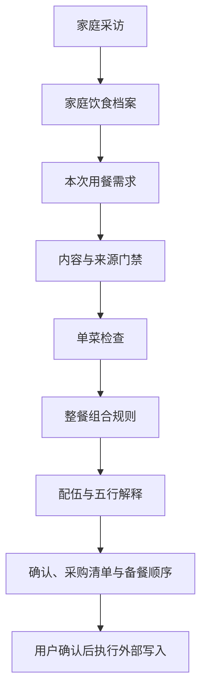

# TCM Family Meal Planner

`tcm-family-meal-planner` is an evidence-bounded Skill for planning Chinese dietary-wellness meals for families.

It starts with a household interview, builds a confirmed food-and-recipe profile, and then plans meals from family preferences, allergies, ages, available ingredients, cooking constraints, and the companion Web App's governed content and deterministic meal rules.

中文说明：这是一个面向家庭的中式食养整餐规划 Skill。它先采访家庭成员、年龄、体质自述、过敏、口味和常做菜，再根据可追溯的项目资料与确定性规则规划一餐或多日计划。

## 什么是“食品配伍”和“配伍餐”？

食品配伍，是按照有出处的中医食养资料、家庭成员的实际情况、食材形态、烹调条件和一顿饭的结构，把几种食材或几道菜组织成一个有理由的家常组合。

配伍餐需要回答：

- 为什么把这些菜放在同一顿饭里？
- 这条理由属于中医食养依据、家庭适配、烹调关系，还是普通整餐结构？
- 哪些食材、形态、做法、人群和用量条件让这个理由成立？
- 哪些内容仍然缺少直接证据？

它用于日常饮食参考，内容不等同于中药方剂、诊断、处方或疾病治疗。五行标注只用于说明传统理论背景；五味、性味、归经、颜色和五行不能在没有来源时互相替代，也不能单独决定菜单。

没有直接组合证据时，Skill 会明确写“结构性搭配”或“直接组合证据尚未建立”，不会把普通菜谱组合包装成正式中医配伍。

## 为什么它能帮助规划中式家庭食谱？

它解决的不是“随便给几道菜”，而是把一家人的真实情况、已有菜谱、食材证据和做饭条件连接起来。

例如规划一顿家庭午餐时，Skill 会同时考虑：

- 谁要吃：人数、年龄、儿童食物安全、过敏和硬忌口；
- 想解决什么场景：快手午餐、周末家常餐、多人聚餐或连续几天计划；
- 家里会做什么：家庭常做菜、喜欢的主食、常用烹法和现有设备；
- 中医依据是什么：食材属性、体质宜慎、传统食养原则和直接组合证据；
- 这顿饭能不能落地：菜品角色、关键食材重复、备餐顺序、份量和预计用时；
- 哪些话可以说：来源能支撑的范围，以及仍然需要标记“尚未评估”的内容。

因此，它可以把“给一家四口安排一顿不辣的午餐”进一步变成可检查的整餐请求：两道菜、一份汤、一份主食，逐人检查过敏和年龄，再按照家庭口味、可用食材、来源证据和半小时限制排序。证据不足时，它会停下来询问或降低结论强度，不用模型常识补齐中医判断。

## Skill 的架构原理



### 1. 家庭采访层

第一次使用时，Skill 先采访家庭成员、年龄、体质自述、过敏、口味和常做菜，形成 `HouseholdFoodProfile` 草案。用户确认后，这份档案才用于后续匹配；下一次只询问发生变化的内容。

### 2. 中医资料与证据层

Skill 不把“中医知识”当成一张无来源的食物属性表，而是优先读取 Web App 的内容链：

```text
SourceRef
  → SourcePassage
  → EvidenceLink
  → Ingredient / Recipe / ConstitutionRule
```

每条中医相关结论都要回答：来源是什么、原文定位在哪里、支撑哪个字段、适用于什么人群和食材形态、不能推出什么结论。

### 3. 安全与单菜层

每道菜先单独检查：

1. 是否命中过敏、硬忌口、儿童安全或监管限制；
2. 菜谱原料、步骤、基准人份和来源是否完整；
3. 关键食材的体质宜慎是否有直接证据；
4. 份量是否可以安全换算；
5. 当前做法、设备和时间是否可执行。

单菜没有通过，就不会为了凑齐午餐角色而把它塞进整餐。

### 4. 整餐组合层

通过单菜检查后，确定性规则再组合整餐：

- 补齐主食、荤热菜、素热菜、汤羹等角色；
- 每顿饭必须且只能有一份主食；
- 避免鸡蛋主菜加蛋花汤等可避免的关键食材重复；
- 聚合每位成员的提醒，不能用另一道“适合”菜抵消风险；
- 计算人数份量、并行备餐时间、难度和采购数量；
- 每次换菜、改人数或改食材后重新检查。

### 5. 配伍与五行解释层

Skill 会把每顿饭的解释分成不同证据层级：

| 层级 | 可以说明什么 |
| --- | --- |
| 直接中医食养依据 | 有来源的食材关系、体质宜慎或正式组合证据 |
| 理论背景 | 有来源的性味、归经或五行对应，只作传统解释 |
| 家庭适配 | 年龄、过敏、口味、软硬度和做饭条件 |
| 结构性搭配 | 菜品角色、主食、份量、时长和重复控制 |

只有直接中医食养依据或正式组合 Claim 存在时，才标记为 `DIRECT_EVIDENCE`。五行属于理论背景层，不能单独生成菜单、判定体质或推出疗效。

### 6. 对话确认与行动层

Skill 不一次性把不确定的菜单当成最终答案，而是：

1. 询问缺失信息；
2. 给出一到两组候选；
3. 解释来源、配伍层级、五行标注状态和风险；
4. 根据用户反馈换菜、改主食、改时间或调整口味；
5. 用户明确确认后生成采购清单和备餐顺序；
6. 只有得到再次授权，才写入 Apple Notes 等外部工具。

## 当前实现边界

当前 Skill 已经能表达“配伍餐”的概念、证据链和五行标注协议，但配套 Web App 仍有两个待建设层：

- 正式的 `DietaryPairingClaim` 数据模型尚未批准，当前没有直接组合证据时只能标记为结构性搭配；
- Web App 尚无正式五行字段，五行内容需要先经过字段、来源和内容治理提案，不能从 `natureFlavorTags` 或 `meridianTags` 自动推导。

这两个边界写入 Skill，是为了让开源使用者看到真实能力范围，也让后续 Web App 的 schema、内容包和前端表达保持同一套定义。

## Invocation

```text
$tcm-family-meal-planner
```

Example:

```text
使用 $tcm-family-meal-planner，先建立我的家庭饮食档案，再根据今天的时间和库存规划晚餐。
```

## Scope

- Uses project-governed `SourceRef`, `SourcePassage`, `EvidenceLink`, `Ingredient`, `Recipe`, and constitution rules when the companion Web App is available.
- Uses deterministic whole-meal composition rules for roles, portions, time, difficulty, ingredient repetition, and shopping lists.
- Requires an evidence boundary for every TCM-related claim.
- Keeps `AI_DRAFT`, machine QA, human review, compliance approval, and activation as separate states.
- Stops when direct pairing evidence is unavailable instead of inventing a TCM pairing claim.
- Does not diagnose, prescribe, promise efficacy, or replace professional advice.

## Installation

Copy this repository directory into the local Skill directory used by your Agent:

```bash
cp -R tcm-family-meal-planner ~/.codex/skills/tcm-family-meal-planner
```

For OpenClaw or another Agent runtime, load the `SKILL.md` file and provide equivalent access to the companion Web App's approved read-only content API or governed content package. The Skill does not grant database, Web App, GitHub, or Apple Notes permissions by itself.

## 没有 Web App 或知识库时怎么办？

这个 Skill 采用“本地知识库优先，Web App 可选”的设计。用户不需要先上线 Web App 才能开始使用。

Skill 会先检测四种情况：

| 模式 | 数据来源 | 可以输出什么 |
| --- | --- | --- |
| `LOCAL_GOVERNED_KB` | 本地 Web App、SQLite 或 `content-package/v1` | 完整的来源约束、整餐规则和可追溯解释 |
| `BUNDLED_STARTER_PACK` | Skill 附带的公开知识包 | 基于 starter pack 的有限范围规划 |
| `LIVE_SOURCE_DRAFT` | 用户提供的资料或临时联网来源 | 带来源的 AI 草案，等待核验 |
| `MEAL_ONLY` | 没有中医知识库 | 普通家常菜、口味、时间、份量和采购清单 |

没有知识库时，Skill 会明确告诉用户：

> 当前环境没有可验证的中医知识库。我可以继续规划普通家常餐；如果要加入性味、五行、体质宜慎或正式配伍判断，需要先提供资料或建立带来源的知识包。

用户可以提供书籍、PDF、网页或已有资料。Agent 会先整理成来源清单和 `content-package/v1` 草案，保留来源定位、授权边界和字段级证据；它不会把临时搜索结果直接变成长期知识，也不会自动写入用户数据库。

这意味着开源用户无需复制完整 Web App 才能使用 Skill，但只有在提供可验证中医资料后，Skill 才会进入中医食养规划模式。

## Companion Web App contract

When the companion Web App is available, the preferred read-only resources are:

```text
GET /api/public/v1
GET /api/public/v1/ingredients
GET /api/public/v1/recipes
GET /api/public/v1/knowledge
GET /api/public/v1/openapi
```

The public API exposes approved, non-mock content only. It does not expose household health profiles or personalized plan writes. Demo content must remain visibly identified as demo or AI draft content.

## License

MIT. See [LICENSE](LICENSE).

## Safety boundary

This project is for daily dietary reference and meal planning. It is not a diagnostic, prescription, disease-treatment, or efficacy-guarantee system. Health and allergy information should remain in the user's authorized private context and should not be committed to this repository.
